# VLVM vs VLFM：架构差异与实验对比

## 0. 摘要

| 维度 | VLFM（2D 基线） | VLVM（3D Native） |
| :--- | :--- | :--- |
| 目标接地 | 2D 检测（GroundingDINO/YOLO）+ MobileSAM 掩码 | **TSP3D 在 3D 体素空间单阶段回归 3D bbox** |
| 投影方向 | 2D → 3D（掩码内像素反投影成点云） | **3D → 2D**（障碍图/价值场由 3D 向下投影） |
| 目标记忆 | ObjectPointCloudMap（掩码内点云累积 + in-range 过滤） | EMA 质心条目 + 票型/可疑度/near_miss 预算（生命周期治理） |
| 建图 | 2D 顶视图障碍图 + fog-of-war | **3D 概率体素（log-odds）** + 3D→2D explored 投影 |
| 语义价值场 | 2D ValueMap（BLIP2-ITM cosine） | 2.5D BEV **S + λ·H₁**（VLFM = λ0 特例，VLVM 为超集） |
| 探索 | frontier_sensor → 价值排序 + acyclic enforcer | **同一实现复用**（对齐） |
| 反幻觉治理 | 逐点 range_id（within_range/too_offset）+ 可选 VQA | occ 门 / S-penalty / 滞回回退 / 锁保持 / GD 辅助票 / 冲突门（机制层更厚） |
| 时间融合 | 无（单帧） | world 8 帧增量 + 视角去重 + 近场刷新（**VLVM 独有**） |
| 单场景 SR | 0.5253（1:29:12） | **0.5657（56/99，最终基线，3:16:23）** |
| 三场景 SR | **0.4411** / Oracle 51.85% / spl 0.2441 | 0.4007 / Oracle **51.85%** / spl 0.1518（V73_base） |

**四条结论**：

1. **Oracle 持平、SR 收敛**：单场景 VLVM Success Rate（0.5657 > 0.5253）/ Oracle Success 反超。
2. **差距不是均匀的**：couch 大幅反超（大体积 3D 物体 TSP3D 占优），toilet / potted plant / tv 明显落后（小 / 弱特征物体 3D 确认难），本质是"目标几何完整度"的函数。
3. **差距根源 = 检测器本体在线的失真结构**：TSP3D 在线局部点云上检测级 precision 约 30–35%（三场景 34.9%），高置信假阳性真/假分数不可分；VLFM 的 2D 检测叠加逐点管理与确认链对局部残缺更鲁棒。

## 1. 系统架构总览

```mermaid
flowchart TB
    subgraph VLFM["VLFM（2D 检测 → 2D 决策）"]
        A1[RGB-D 帧] --> A2[GroundingDINO / YOLO 2D 检测]
        A2 --> A3[MobileSAM bbox 分割]
        A3 --> A4[掩码内像素反投影 → 3D 点累积]
        A4 --> A5[ObjectPointCloudMap 逐点 in-range]
        A1 --> A6[2D 障碍图 + fog-of-war]
        A1 --> A7[BLIP2-ITM 2D ValueMap]
        A5 --> A8[最近簇 = 目标点云]
        A6 --> A9[frontier_sensor]
        A7 --> A9
        A9 --> A10[价值排序选 frontier]
        A8 --> A11[PointNav → 表面点停靠]
        A10 --> A11
    end
    subgraph VLVM["VLVM（3D Native）"]
        B1[RGB-D 帧] --> B2[3D 点云 · world 增量融合 8 帧窗]
        B2 --> B3[TSP3D 查询 → 3D bbox]
        B3 --> B4[S-penalty c'=c·w_S 语义交叉验证]
        B4 --> B5[occ 门 · 体素占据一致性]
        B5 --> B6[EMA 条目记忆 · 票型/可疑/near_miss]
        B1 --> B7[3D 概率体素障碍图]
        B7 --> B8[3D→2D explored/通行带投影]
        B1 --> B9[BLIP2-ITM 2.5D 价值场 S+λH₁]
        B6 --> B10[锁定 3D 条目 · 锁保持]
        B8 --> B12[frontier_sensor]
        B9 --> B12
        B12 --> B13[价值排序选 frontier]
        B10 --> B14[PointNav → 近表面点停靠]
        B13 --> B14
        B15[GD 辅助第二源 both/gd] --> B6
    end
```

### 分层对应（模块 → 实现文件）

| 层 | VLFM（原版） | VLVM（本仓库） |
| :--- | :--- | :--- |
| 基类 / 感知接口 | `vlfm/policy/base_objectnav_policy.py`（402 行） | `vlfm/policy/tsp3d_objectnav_policy.py`（~1.5k 行，3D 感知 + 决策主体） |
| 探索 / 价值场 | `vlfm/policy/itm_policy.py`（BaseITMPolicy，2D ValueMap） | `vlfm/policy/itm_policy.py`（BaseITMPolicy **继承 TSP3DObjectNavPolicy**，2.5D 价值场） |
| Habitat 集成 | habitat_policies.py | `vlfm/policy/habitat_policy.py`（Habitat3DMixin + ITMPolicyV1/V2 + Oracle 变体） |
| 建图 | `vlfm/mapping/obstacle_map.py`（2D）、`value_map.py` | 3D：`vlfm/mapping/obstacle_map.py`（ObstacleMap3D/ProbabilisticGrid）；2.5D 价值场复用 `value_map.py` |
| 检测 | `vlfm/vlm/grounding_dino.py` + `yolo.py` + `mobile_sam.py` | `vlfm/vlm/tsp3d.py`（HTTP 客户端）；`vlfm/tsp3d_models/grounding_dino/`（GD 辅助源） |
| 目标记忆 | ObjectPointCloudMap（`vlfm/mapping/object_point_cloud_map.py`） | `vlfm/tsp3d_models/utils/target_memory_manager.py`（EMA 条目层） |
| 融合 / 输入适配 | 无 | `vlfm/tsp3d_models/utils/pipeline.py`（world/camera/panoramic + D3 采样） |
| 机制治理 | 回退（update_explored） | `s_penalty.py` / `target_geometric_gating.py` / GD 包 |

## 2. 逐模块架构差别

### 2.1 感知与目标接地（结构性差别 ★）

| | VLFM | VLVM |
| :--- | :--- | :--- |
| 检测器 | GroundingDINO（non-COCO）与 YOLO（COCO 类）**双路自动选择**，并集重试 | **TSP3D**（文本引导稀疏体素剪枝）：3D 点云直接回归 3D bbox，单阶段 |
| 分割 | MobileSAM 按 bbox 二次分割（掩码用于点云提取） | 无分割——3D bbox 自带几何（无需 2D 掩码反投影） |
| 阈值 | `coco_threshold=0.8` / `non_coco_threshold=0.4`（2D 分类置信度） | `sigma_tar=0.70`（3D 目标置信度）+ S-penalty `c' = c·w_S(S) ≥ sigma_tar` 双重准入 |
| 输入构建 | 单帧 RGB（检测）/ 单帧深度（掩码投影） | world 增量地图 8 帧窗 + 视角去重 + 距离自适应采样（D3），局部帧 → camera-canonical |
| 在线失真 | 2D 外观特征对局部遮挡/尺度较鲁棒 | 训练于完整扫描（ScanRefer），在线**局部点云壳**导致近景回归病态 → 高置信幻觉框 |

### 2.2 投影方向相反（理解两套架构的钥匙）

- **VLFM**：**2D → 3D**。检测与分割都在图像域完成，深度把掩码像素反投影为 3D 点，累积成目标点云。地图（障碍/价值）也是 2D 顶视图 —— 三维信息只存在于"目标点云"这一处。
- **VLVM**：**3D → 2D**。目标在 3D 体素域直接回归（bbox + 质心 + 近表面点）；障碍图是 3D 概率体素，价值场与 explored 掩码由 3D 向下投影（`_get_explored_2d` 的"通行带" H₁ 参数 `h_z_min/h_z_max`）。
- 后果：VLVM 的"目标"天然带 (x,y,z) 与几何尺度（终点 = 近表面点）；VLFM 的目标是点云簇（终点 = 簇表面点）。**两者停靠语义后来对齐，但中间表示完全不同。**

### 2.3 建图

| | VLFM | VLVM |
| :--- | :--- | :--- |
| 表示 | 2D 顶视图障碍栅格 + 探索 fog | **3D 概率体素**（`ProbabilisticGrid`：explored 累积 + log-odds 贝叶斯更新 + 消费层排除障碍） |
| 高度信息 | 高度过滤（投影时裁剪带） | 体素含高度轴；导航切片 `nav_slice_height`、通行带 `h_z_min/h_z_max` 从 3D 导出 |
| 与决策耦合 | frontier（2D sensor）+ 价值图（2D） | frontier 同源（habitat sensor）；occ 门直接查 3D 体素（检测级） |
| 开发史 | — | OctoMap 版本因建图慢 6.6×/状态不稳定弃用（S1 §2.1）；三态→二态重构逐字节对齐 baseline |

### 2.4 语义价值场

- **共用数学**：`ValueMap`（BLIP2-ITM cosine，prompt 按 `|` 分通道，置信度加权 max）两侧同名同源，VLVM 直接复用 VLFM 实现。
- **VLVM 超集**：`S_final = S + λ·H₁`（λ=0.3）——H₁ 为高度通行带内自由空间占比。**λ→0 即退化为 VLFM**。
- 用途差异：VLFM 的价值场只用于 **frontier 排序（探索）**；VLVM 的价值场同时被 **S-penalty** 查询（`_query_semantic_at` → `_query_2d_value`），即价值场从"探索打分器"升级为"检测交叉验证信号源"——这是 VLVM 单场景 +12.1pp 的来源之一。

### 2.5 目标记忆与生命周期（差异最大的一层）

| | VLFM | VLVM |
| :--- | :--- | :--- |
| 存储 | ObjectPointCloudMap：mask 内像素累积点云（每类一份） | **EMA 质心条目**（无点云）：质心 + 近表面点 + (num_obs, c') + 回退状态 |
| 观测过滤 | 逐点 `in_range`（距离/角度锥）后入库 | 条目级：`num_obs` 计数、EMA 合并（0.5 m）、跨帧票型合并 |
| 删除 / 回退 | `update_explored`：逐点 within_range/too_offset → 点被裁掉 → 簇弱化 | `near_miss` 滞回预算：条目进入近场 FOV 锥每帧 +1，≥ 阈值（可信 5 / 可疑 2）删除 → `fallback to explore` |
| 保护机制 | （无锁概念；簇天然伴随点云持续重观测） | **锁保持 `lock_exempt`**：navigate 锁定期间 nav goal 条目豁免删除预算（防"延迟停靠"变"丢条目"）；**身份豁免 `lock_exempt_identity`**：以条目质心（而非 nav goal 近表面点）做 0.5 m 匹配 |
| 票型系统 | 无（单一检测源） | **tsp3d / gd / both** 三票：跨帧不同源合并 ⇒ `both`（清可疑）；单侧写 ⇒ 可疑预算 |
| 可疑预算 | 无 | GD 开启时新条目恒标可疑（2 帧预算）vs 定稿非可疑 5 帧；`both` 合并清除 |

### 2.6 决策与执行

| | VLFM | VLVM |
| :--- | :--- | :--- |
| 探索选点 | frontier_sensor → ValueMap 评分 → acyclic enforcer + stick-to-last | **同一实现**（BaseITMPolicy 复用） |
| 目标锁定 | `_get_best_object`：最近簇 + `_last_target_coord` latch（0.1 / 0.5 m 滞回） | 最近 3D 条目 + **同款 latch**（镜像实现）；附加 `is_lockable`（GD 单票需 ≥ `lock_min_obs` 观测）与冲突门拦截 |
| 导航执行 | PointNav RL 策略（rho/theta）；goal 变动 >0.1 m 时 LSTM reset | 同（**reset 阈值 0.5 m**——3D 前沿质心抖动更大，刻意不对齐） |
| 停靠 | `pointnav_stop_radius=0.9`；终点 = 目标点云最近表面点 | `0.90`（运行配置，已对齐）；终点 = 条目近表面点（`goal_use_surface=True`，已对齐） |
| 扫描旁路 | 无 | world 模式下可选 360° 扫描（默认关；判负记录见 VLVM-S2/V5） |

### 2.7 输入适配与时间融合（VLVM 独有）

- VLFM 单帧检测（无时间维度）。VLVM 的 world 地图承载 **8 帧增量 + 视角去重（0.15 m / 15°）+ 近场刷新（wm_near_refresh，3 m）**，把局部观测补成接近训练分布的完整几何 —— 这是 TSP3D 对输入完整度敏感的直接对策。
- 代价：world 全历史（无帧窗）会推高 fp（校准失真）；`max_frames=8` 后有界，与 camera 等价（逐集 4 换 4）。
- 距离自适应采样（D3）：近 0.01 / 中 0.02 / 远 0.05 m，camera 系 +2pp；world 系为耗时优化（每步 −21.8%）。

